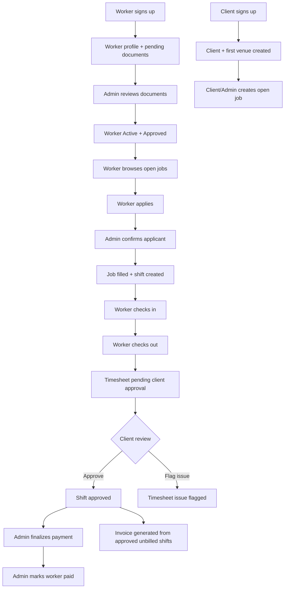
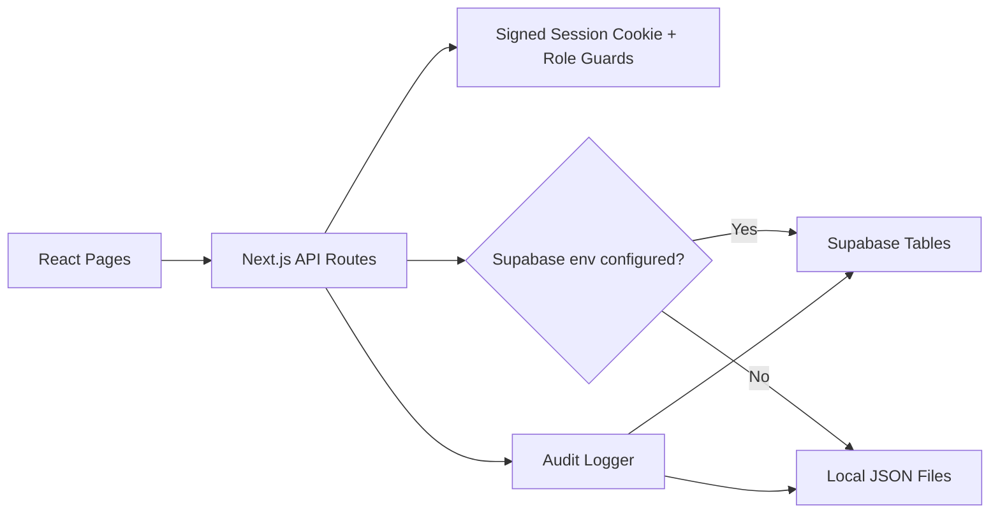

# Staff Tracker Application Functionality

Last updated: May 2026

## 1. Product Overview

Staff Tracker is a SaaS-style staffing operations application for hospitality teams. It supports three main audiences:

- Admin teams who manage clients, venues, workers, documents, job postings, assignments, shifts, approvals, invoices, and audit logs.
- Client/company users who create and manage their own venues/jobs, monitor shifts, approve or flag timesheets, and generate invoices for their own account.
- Workers who complete onboarding, upload profile/documents, browse open jobs after approval, apply to jobs, and check in/out of assigned shifts.

The application is built with Next.js App Router, React, Tailwind CSS, Framer Motion, Lucide icons, and a server-side API layer. Data can run in two modes:

- Supabase mode when Supabase environment variables are present.
- Local JSON fallback mode when Supabase environment variables are missing.

The intended MVP flow is:

1. Client signs up and creates a company account plus first venue.
2. Worker signs up and submits profile/documents.
3. Admin approves worker documents and activates the worker.
4. Client or admin creates job postings.
5. Approved workers browse and apply to open jobs.
6. Admin confirms an applicant or directly assigns a worker.
7. Assignment creates an upcoming shift.
8. Worker checks in and checks out.
9. Check-out creates a timesheet.
10. Client approves or flags the timesheet.
11. Admin can approve/reject, finalize worker payment, mark paid, and mark client invoiced.
12. Approved, unbilled shifts can be grouped into invoices.

## 2. Technology Stack

Runtime and framework:

- Next.js 16 App Router
- React 19
- TypeScript
- Tailwind CSS 4
- Framer Motion for UI motion
- Lucide React for icons

Data and persistence:

- Supabase through `@supabase/supabase-js`
- Local JSON file fallback for development or offline operation
- Signed HTTP-only session cookie for application auth
- PBKDF2 password hashing

Main scripts:

- `npm run dev`: start development server
- `npm run build`: production build
- `npm run start`: start production server
- `npm run lint`: lint project

## 3. Main Application Areas

### Public Pages

`/`

Landing page for the SaaS product. It presents Staff Tracker as a workforce operations platform and links users to worker, client, and admin login/signup flows.

`/login/admin`

Admin login screen. Authenticates against `/api/login` and expects an admin or super admin account to access the admin dashboard.

`/login/client`

Client/company login screen. Authenticates against `/api/login` and routes client users into `/dashboard`.

`/login/worker`

Worker login screen. Authenticates against `/api/login` and routes workers into `/worker/dashboard`.

`/signup/client`

Client onboarding flow. Creates:

- Portal user with role `user`
- Client/company record
- First venue record

`/signup/worker`

Worker onboarding flow. Creates:

- Portal user with role `worker`
- Worker profile record
- Initial pending document records when filenames are provided

Workers start with `status: Pending` and `documentStatus: Pending`.

### Admin And Client Dashboard

All `/dashboard/*` pages use `src/app/dashboard/layout.tsx`.

The dashboard shell:

- Reads the current user from `/api/me`.
- Redirects unauthenticated users to `/`.
- Limits client users to `/dashboard`, `/dashboard/jobs`, `/dashboard/venues`, and `/dashboard/shifts`.
- Shows desktop sidebar, mobile tabs, command-style search surface, profile identity, and logout.

Main dashboard pages:

- `/dashboard`: overview of KPIs, active field operations, and alerts.
- `/dashboard/jobs`: create/edit jobs, view applicants, confirm/reject applicants, assign/unassign workers.
- `/dashboard/shifts`: monitor shifts, approve/flag timesheets, handle admin billing/payment states.
- `/dashboard/workers`: admin worker management, status, reliability, roles, document status, notes, and documents.
- `/dashboard/documents`: admin document review queue for worker documents.
- `/dashboard/clients`: admin/client account management.
- `/dashboard/venues`: venue management scoped by role.
- `/dashboard/settings`: admin user/settings management.
- `/dashboard/reports` and `/dashboard/ai`: present in routing as additional dashboard sections.

### Worker Portal

All `/worker/*` pages use `src/app/worker/layout.tsx`.

Worker pages:

- `/worker/dashboard`: worker home view.
- `/worker/shifts`: assigned shifts and open job marketplace behavior.
- `/worker/profile`: editable worker profile and document upload/update flow.
- `/worker/earnings`: earnings/timesheet-facing worker view.

Worker access to open marketplace jobs is restricted until the worker is both:

- `status: Active`
- `documentStatus: Approved`

This is enforced server-side by `workerMayAccessOpenMarketplace()`.

## 4. Authentication And Roles

Authentication is implemented in `src/lib/auth.ts`.

Supported roles:

- `super_admin`
- `admin`
- `user`
- `worker`

Login flow:

1. User submits email/password to `POST /api/login`.
2. API looks up the user in Supabase `users` table or local `users.json`.
3. Password is verified with PBKDF2.
4. Legacy plain-text passwords in JSON mode are upgraded to hashed passwords on successful login.
5. API returns sanitized user data without password.
6. API sets an HTTP-only `session` cookie.

Session cookie:

- Contains signed user payload.
- Uses HMAC SHA-256.
- Expires after 7 days.
- Is HTTP-only.
- Uses `sameSite: lax`.
- Uses `secure` in production.

Current user:

- `GET /api/me` reads and validates the session cookie.
- Dashboard and worker layouts use `/api/me` for bootstrapping.

Logout:

- `POST /api/logout` clears the session cookie.

Authorization:

- API routes use `getSessionUserFromRequest()`, `hasRole()`, `unauthorized()`, and `forbidden()`.
- Role gates are enforced in the server API, not only the UI.

## 5. Persistence Model

The application has dual persistence.

### Supabase Mode

When `NEXT_PUBLIC_SUPABASE_URL` and either `NEXT_PUBLIC_SUPABASE_ANON_KEY` or `SUPABASE_SERVICE_ROLE_KEY` exist, `hasSupabaseEnv()` returns true and server routes use Supabase.

Server-side Supabase client:

- Uses `SUPABASE_SERVICE_ROLE_KEY` when available.
- Falls back to anon key.
- Does not persist Supabase auth sessions.

Primary Supabase tables:

- `users`
- `workers`
- `clients`
- `venues`
- `jobs`
- `shifts`
- `timesheets`
- `invoices`
- `audit_logs`

Schema files:

- `supabase/week1_schema.sql`: main fresh-install schema.
- `supabase/week2_e2e.sql`: incremental timesheet additions for older installs.

### Local JSON Fallback Mode

When Supabase env vars are missing, API routes read/write JSON files in the project root:

- `users.json`
- `workers.json`
- `clients.json`
- `venues.json`
- `jobs.json`
- `shifts.json`
- `timesheets.json`
- `invoices.json`
- `audit_logs.json`

JSON writes use:

- Atomic temp-file write plus rename.
- In-process file locks for concurrent write safety.
- Application-generated text IDs.

ID prefixes:

- `U-0001`: users
- `W-0001`: workers
- `C-0001`: clients
- `V-0001`: venues
- `J-0001`: jobs
- `S-0001`: shifts
- `TS-0001`: timesheets
- `INV-0001`: invoices
- `LOG-0001`: audit logs

## 6. Core Data Objects

### User

Stored in `users`.

Important fields:

- `id`
- `name`
- `email`
- `password`
- `role`
- `created_at` or `createdAt`

Users are portal identities. Workers and clients also have separate domain records.

### Worker

Stored in `workers`.

Important fields:

- `id`
- `name`, `firstName`, `lastName`
- `email`, `phone`, `address`
- `status`: commonly `Pending` or `Active`
- `documentStatus`: commonly `Pending` or `Approved`
- `reliability`
- `roles`
- `roleOverrides`
- `flags`
- `notes`
- `shiftHistory`
- `lifetimeEarnings`
- onboarding profile fields such as legal status, LinkedIn, postal code, neighborhoods, years experience, bio
- certification fields such as Smart Serve and Food Handler
- `documents`

Document approval rules:

- Worker-submitted documents are normalized as `Pending`.
- Admin updates can approve/reject per document.
- Aggregate `documentStatus` is `Approved` only when documents exist and none are `Pending` or `Rejected`.
- Admin cannot mark worker `Active` unless documents are approved.
- If admin approves documents for a pending worker, the API can move that worker to `Active`.

### Client

Stored in `clients`.

Important fields:

- `id`
- `name`
- `contactName`
- `email`
- `phone`
- `status`
- `paymentMethod`
- `address`
- `industry`
- `taxId`
- `customRates`
- `preferredWorkers`
- `venueCount`
- `billingEmail`
- `venueType`
- `staffingRoles`
- `staffingFrequency`
- `logistics`
- `createdByUserId`

Client users are scoped to their own client record by `createdByUserId` or matching email.

### Venue

Stored in `venues`.

Important fields:

- `id`
- `clientId`
- `clientName`
- `name`
- `address`
- `gps`
- `status`
- `contactName`
- `phone`
- `notes`
- `venueType`
- `departments`
- `instructions`
- `dressCode`
- `parkingInfo`

Client users can only list, create, or update venues belonging to their own client account.

### Job

Stored in `jobs`.

Important fields:

- `id`
- `clientId`
- `clientName`
- `venueId`
- `venueName`
- `role`
- `status`: `Open`, `Filled`, or `Cancelled`
- `date`
- `startTime`
- `endTime`
- `hours`
- `hourlyRate` or `rate`
- `headcount`
- `description`
- `requirements`
- `assignedWorkerId`
- `assignedWorkerName`
- `applicants`
- `isUrgent`
- `instructions`
- `uniform`
- `parking`

Applicant statuses:

- `pending_admin`
- `confirmed`
- `rejected`
- `withdrawn`

### Shift

Stored in `shifts`.

Important fields:

- `id`
- `jobId`
- `clientId`
- `clientName`
- `venueId`
- `venueName`
- `role`
- `date`
- `scheduledStart`
- `scheduledEnd`
- `hours`
- `rate`
- `status`: `Upcoming`, `Active`, `Completed`, `Cancelled`
- `workerId`
- `workerName`
- `actualCheckIn`
- `actualCheckOut`
- `gpsStatus`
- `isFlagged`
- `flagReason`
- `timesheetId`
- `paymentStatus`: `pending`, `finalized`, `paid`
- `invoiceStatus`: `pending`, `invoiced`
- `isApproved`
- `isInvoiced`
- `invoiceId`

### Timesheet

Stored in `timesheets`.

Important fields:

- `id`
- `shiftId`
- `workerId`
- `workerName`
- `clientId`
- `clientName`
- `venueName`
- `role`
- `date`
- scheduled and actual times
- `hours`
- `rate`
- `status`
- rejection/issue reason fields
- approval metadata

Timesheet statuses include:

- `pending_client_approval`
- `approved_by_client`
- `approved_by_admin`
- `issue_flagged`
- `rejected_by_admin`

### Invoice

Stored in `invoices`.

Important fields:

- `id`
- `clientId`
- `clientName`
- `amount`
- `status`
- `createdAt`
- `shiftCount`
- `shiftIds`
- `dueDate`

Invoices are generated from approved, unbilled shifts.

### Audit Log

Stored in `audit_logs`.

Important fields:

- `id`
- `action`
- `details`
- `userEmail`
- `userId`
- `timestamp`

Audit logs are written for major admin/client/worker actions such as creating jobs, assigning workers, updating records, approving timesheets, and generating invoices.

## 7. Main Workflows

### Client Signup

Endpoint: `POST /api/signup/client`

Input includes:

- company name
- contact name
- email, phone, password
- billing email
- first venue name/type/address
- staffing roles/frequency
- uniform, instructions, parking

Behavior:

1. Validates required account fields.
2. Validates email format.
3. Validates password length.
4. Requires venue name and address.
5. Checks duplicate portal email.
6. Creates user with role `user`.
7. Creates client record.
8. Creates first venue record.
9. Rolls back created user/client if later Supabase insert fails.

Result:

- Client user can log in through client login.
- Client gets scoped dashboard access.

### Worker Signup

Endpoint: `POST /api/signup/worker`

Input includes:

- first/last name
- email, phone, password
- legal/profile fields
- roles
- experience
- certifications
- uploaded document filenames

Behavior:

1. Validates required fields.
2. Validates email format.
3. Validates password length.
4. Checks duplicate email.
5. Creates user with role `worker`.
6. Creates worker profile.
7. Sets worker status to `Pending`.
8. Sets document status to `Pending`.
9. Adds pending document records for resume/additional document filenames.

Result:

- Worker can log in.
- Worker cannot browse/apply to open jobs until active and document approved.

### Worker Document Approval

Primary endpoint: `PUT /api/workers`

Admin behavior:

1. Admin updates worker document records.
2. API computes aggregate document status.
3. If all docs are approved, document status becomes `Approved`.
4. If document status is approved and worker was pending, worker can become active.
5. API rejects `status: Active` if document status is not approved.

Result:

- Approved/active workers become eligible for marketplace jobs.

### Client/Admin Job Creation

Endpoint: `POST /api/jobs`

Allowed roles:

- `admin`
- `super_admin`
- `user`

Behavior:

1. Authenticates actor.
2. Validates required job fields.
3. If client user, resolves their client account and forces job client ownership.
4. Validates venue ownership for client-created jobs.
5. Creates job with status `Open` unless otherwise supplied.
6. Stores venue, role, date/time, hours, rate, headcount, instructions, uniform, parking, urgent flag, and applicants list.
7. Records audit log.

Client users cannot create jobs for another client.

### Worker Open Job Marketplace

Endpoint: `GET /api/jobs`

Worker behavior:

1. API checks session role `worker`.
2. API calls `workerMayAccessOpenMarketplace(actor.id)`.
3. Worker must be `Active` and `Approved`.
4. If eligible, API returns jobs with `status: Open`.
5. If not eligible, API returns an empty list.

### Worker Apply To Job

Endpoint: `POST /api/jobs/apply`

Allowed role:

- `worker`

Behavior:

1. Authenticates worker.
2. Confirms worker is active and document-approved.
3. Validates job exists.
4. Requires job status `Open`.
5. Rejects if job already has an assigned worker.
6. Adds or updates applicant entry with `status: pending_admin`.
7. Prevents duplicate pending applications.
8. Prevents applying again if already confirmed.

Result:

- Admin sees applicant as pending review.

### Worker Withdraw Application

Endpoint: `POST /api/jobs/withdraw`

Allowed role:

- `worker`

Behavior:

1. Finds pending application for the authenticated worker.
2. Changes status to `withdrawn`.
3. Returns updated job DTO.

Only pending applications can be withdrawn.

### Admin Assignment

Endpoint: `POST /api/jobs/assignment`

Allowed roles:

- `admin`
- `super_admin`

Supported actions:

- `confirm_applicant`
- `admin_direct_assign`
- `reject_applicant`
- `unassign`

Confirm applicant behavior:

1. Job must exist and be open.
2. Worker must have a pending application.
3. Worker must be active and document-approved.
4. Selected applicant becomes `confirmed`.
5. Other pending applicants are auto-rejected.
6. Job becomes `Filled`.
7. Job stores assigned worker id/name.
8. Upcoming shift is created if a non-cancelled duplicate does not exist.
9. Audit log records assignment.

Direct assign behavior:

1. Job must be open and unassigned.
2. Worker must be active and document-approved.
3. Worker is inserted/marked as confirmed in applicants.
4. Job becomes filled.
5. Shift is created.

Reject applicant behavior:

1. Applicant must exist.
2. Applicant must be pending.
3. Applicant becomes rejected with reason.

Unassign behavior:

1. Job must be filled.
2. Assigned worker is removed.
3. Job returns to open.
4. Former confirmed applicant state is adjusted.
5. Matching upcoming/active shift is cancelled.

Important constraint:

- Admins cannot change staffing assignment directly with `PUT /api/jobs`.
- Staffing changes must use `/api/jobs/assignment` so shift creation/cancellation stays consistent.

### Shift Lifecycle

Shifts can be created by:

- Admin directly via `POST /api/shifts`.
- Job assignment via `POST /api/jobs/assignment`.

Shift statuses:

1. `Upcoming`
2. `Active`
3. `Completed`
4. `Cancelled`

Client users see only shifts for their own client account.
Workers see only their own shifts.
Admins see all shifts.

### Worker Check-In

Endpoint: `POST /api/shifts/actions`

Action: `worker_check_in`

Allowed role:

- `worker`

Rules:

- Worker can only check into their own shift.
- Shift must be `Upcoming`.

Behavior:

- Sets status to `Active`.
- Stores actual check-in time.
- Stores GPS status, defaulting to `Verified`.
- Records audit log.

### Worker Check-Out And Timesheet Creation

Endpoint: `POST /api/shifts/actions`

Action: `worker_check_out`

Allowed role:

- `worker`

Rules:

- Worker can only check out from their own shift.
- Shift must be `Active`.

Behavior:

1. Sets shift status to `Completed`.
2. Stores actual check-out time.
3. Calculates billable hours from actual check-in/out, including overnight shifts.
4. Creates or updates a timesheet.
5. Timesheet status becomes `pending_client_approval`.
6. Shift stores `timesheetId`.
7. Shift payment/invoice status remains pending.
8. Audit log records check-out.

### Client Timesheet Review

Endpoint: `POST /api/shifts/actions`

Actions:

- `client_approve_timesheet`
- `client_flag_issue`

Allowed roles:

- `user`
- Admin roles are also accepted for approval-like operations where allowed.

Client rules:

- Shift must be `Completed`.
- Shift must have a timesheet.
- Client user can only review shifts belonging to their own client account.

Approve behavior:

- Timesheet status becomes `approved_by_client`.
- Shift `isApproved` becomes true.
- Shift flag state is cleared.
- Audit log records approval.

Flag behavior:

- Timesheet status becomes `issue_flagged`.
- Issue reason is stored.
- Shift `isFlagged` becomes true.
- Shift `flagReason` is set.
- Audit log records issue.

### Admin Timesheet And Payment Workflow

Endpoint: `POST /api/shifts/actions`

Admin actions:

- `admin_approve_timesheet`
- `admin_reject_timesheet`
- `admin_override_assignment`
- `admin_finalize_payment`
- `admin_mark_paid`
- `admin_mark_invoiced`

Admin approval:

- Requires completed shift and timesheet.
- Timesheet status becomes `approved_by_admin`.
- Shift `isApproved` becomes true.

Admin rejection:

- Requires completed shift and timesheet.
- Timesheet status becomes `rejected_by_admin`.
- Rejection reason is stored.
- Shift becomes flagged.

Admin override assignment:

- Changes shift worker id/name.
- Resets shift to `Upcoming`.

Finalize payment:

- Requires shift `isApproved`.
- Sets `paymentStatus` to `finalized`.

Mark paid:

- Sets `paymentStatus` to `paid`.

Mark invoiced:

- Sets `invoiceStatus` to `invoiced`.
- Sets `isInvoiced` to true.

### Invoice Generation

Endpoint: `POST /api/invoices`

Allowed roles:

- `admin`
- `super_admin`
- `user`

Rules:

- Client id and client name are required.
- Client users can only generate invoices for their own client account.
- Invoice source shifts must be:
  - For the selected client.
  - Approved.
  - Not already invoiced.
  - Optionally limited to selected shift ids.

Behavior:

1. Finds approved unbilled shifts.
2. Calculates invoice amount from `hours * rate`.
3. Creates invoice with status `Pending`.
4. Sets due date to 14 days from creation.
5. Marks included shifts as invoiced and stores invoice id.
6. Records audit log.

### Audit Trail

Endpoint: `GET /api/audit`

Allowed roles:

- `admin`
- `super_admin`

Behavior:

- Reads up to 1000 audit logs from Supabase if available.
- Falls back to `audit_logs.json`.
- Returns action, details, user identity, and timestamp.

Common logged actions:

- Create/update/delete client
- Create/update/delete venue
- Create/update/delete job
- Assign/unassign/reject applicant
- Create/update shift
- Worker check-in/check-out
- Client/admin timesheet review
- Payment and invoice events
- User management events

## 8. API Endpoint Summary

Authentication:

| Endpoint | Method | Roles | Purpose |
| --- | --- | --- | --- |
| `/api/login` | POST | public | Login and set session cookie |
| `/api/logout` | POST | authenticated | Clear session cookie |
| `/api/me` | GET | authenticated | Return current sanitized user |

Signup:

| Endpoint | Method | Roles | Purpose |
| --- | --- | --- | --- |
| `/api/signup/client` | POST | public | Create client user, client account, first venue |
| `/api/signup/worker` | POST | public | Create worker user and worker profile |

Operations:

| Endpoint | Method | Roles | Purpose |
| --- | --- | --- | --- |
| `/api/jobs` | GET | admin, super_admin, user, worker | List jobs scoped by role |
| `/api/jobs` | POST | admin, super_admin, user | Create job |
| `/api/jobs` | PUT | admin, super_admin, user | Update job details, not staffing assignment |
| `/api/jobs` | DELETE | admin, super_admin | Delete job |
| `/api/jobs/apply` | POST | worker | Apply to open job |
| `/api/jobs/withdraw` | POST | worker | Withdraw pending application |
| `/api/jobs/assignment` | POST | admin, super_admin | Confirm, direct assign, reject, or unassign |
| `/api/shifts` | GET | admin, super_admin, user, worker | List shifts scoped by role |
| `/api/shifts` | POST | admin, super_admin | Create shift directly |
| `/api/shifts` | PUT | admin, super_admin | Update shift directly |
| `/api/shifts/actions` | POST | role depends on action | Check in/out, approve/flag, payment/invoice actions |
| `/api/timesheets` | GET | admin, super_admin, user, worker | List timesheets scoped by role |
| `/api/invoices` | GET | admin, super_admin, user | List invoices scoped by role |
| `/api/invoices` | POST | admin, super_admin, user | Generate invoice |

Management:

| Endpoint | Method | Roles | Purpose |
| --- | --- | --- | --- |
| `/api/workers` | GET | admin, super_admin | List workers |
| `/api/workers` | POST | admin, super_admin | Create worker record |
| `/api/workers` | PUT | admin, super_admin, worker | Update worker record/profile, scoped |
| `/api/workers` | DELETE | admin, super_admin | Delete worker and user in Supabase mode |
| `/api/worker/profile` | GET | worker | Get own worker profile |
| `/api/worker/profile` | PUT | worker | Update own worker profile/documents |
| `/api/clients` | GET | admin, super_admin, user | List clients scoped by role |
| `/api/clients` | POST | admin, super_admin | Create client account manually |
| `/api/clients` | PUT | admin, super_admin, user | Update client scoped by role |
| `/api/clients` | DELETE | admin, super_admin | Delete client |
| `/api/venues` | GET | admin, super_admin, user | List venues scoped by role |
| `/api/venues` | POST | admin, super_admin, user | Create venue scoped by role |
| `/api/venues` | PUT | admin, super_admin, user | Update venue scoped by role |
| `/api/venues` | DELETE | admin, super_admin | Delete venue |
| `/api/users` | GET | admin, super_admin | List portal users |
| `/api/users` | POST | admin, super_admin | Create portal user |
| `/api/users` | DELETE | admin, super_admin | Delete portal user, except last super admin |
| `/api/audit` | GET | admin, super_admin | Read audit logs |
| `/api/supabase/health` | GET | server/admin use | Check Supabase connectivity/schema health |

## 9. Role-Based Access Rules

Admin and super admin:

- Full operational visibility.
- Can manage workers, clients, venues, jobs, shifts, users, documents, audit logs.
- Can assign workers and perform payment/invoice actions.

Client/company user:

- Can access only their own client account data.
- Can create/update their own venues.
- Can create/update jobs for their own account.
- Cannot directly assign workers.
- Can see shifts/timesheets/invoices for own client account.
- Can approve or flag completed timesheets.
- Can generate invoices for own approved unbilled shifts.

Worker:

- Can access own worker profile.
- Can upload/update own profile/documents.
- Can see own assigned shifts.
- Can see open marketplace jobs only after Active + Approved.
- Can apply/withdraw applications.
- Can check in/out of own shifts.
- Cannot access admin/client management endpoints.

## 10. Supabase Integration Details

The application does not rely on Supabase Auth for MVP login. It uses its own `users` table and signed app cookie.

Supabase is used as database storage when configured.

Required environment variables:

- `NEXT_PUBLIC_SUPABASE_URL`
- `NEXT_PUBLIC_SUPABASE_ANON_KEY`
- `SUPABASE_SERVICE_ROLE_KEY` recommended for server routes
- `SESSION_SECRET` required in production runtime

Server routes create a Supabase client in `src/lib/supabase.ts`.

Row mapping:

- Supabase tables use snake_case.
- React app and JSON fallback use camelCase.
- DTO helpers map rows into app shape:
  - `workerDbRowToApp`
  - `jobRowToClientJob`
  - `shiftRowToClient`
  - `timesheetRowToClient`
  - local DTO functions in route files for clients, venues, invoices

Health:

- `/api/supabase/health` checks whether expected tables are available.

RLS note:

- Server routes are written for service-role/server usage.
- If Supabase Row Level Security is enabled, policies must match the server/client access model.

## 11. UI And Navigation Behavior

The UI has been shaped as a compact SaaS workspace inspired by Monday/Slack.

Global design:

- `src/app/globals.css` defines tokens, cards, command surfaces, metric cards, status pills, mobile table behavior, focus states, and subtle hover behavior.

Dashboard shell:

- Desktop sidebar groups app boards.
- Sticky command header shows current section.
- Mobile layout uses horizontal command tabs and bottom navigation.
- Client users are routed away from admin-only pages.

Landing page:

- Shows product preview, metrics, and signup/login entry points.

Dashboard overview:

- Shows admin/client/worker relevant KPIs.
- Pulls jobs, shifts, workers, clients, venues, invoices, and timesheets.
- Surfaces active shifts and operational alerts.

Jobs page:

- Lists jobs in compact table/card format.
- Supports filtering/searching.
- Handles job creation/editing and applicant assignment flows.

Shifts page:

- Lists shifts and billing/timesheet state.
- Supports status filtering/searching.
- Shows actions depending on role and state.

Workers/documents:

- Admin manages worker profiles and document approval.
- Worker profile page allows self-service profile/document updates.

## 12. Important Business Logic

Marketplace gate:

- Workers cannot browse/apply unless `status === "Active"` and `documentStatus === "Approved"`.

Client scoping:

- Client user data is resolved by `createdByUserId` or matching email.
- Client users cannot access or mutate other clients' jobs, venues, shifts, timesheets, or invoices.

Assignment integrity:

- Staffing changes must use `/api/jobs/assignment`.
- Assignment creates a shift.
- Unassignment cancels a related upcoming/active shift.

Timesheet integrity:

- Check-out creates timesheet.
- Completed shifts require timesheets for approval/rejection.
- Client approval marks shift approved.
- Payment finalization requires approval.

Invoice integrity:

- Only approved, unbilled shifts can be invoiced.
- Invoice generation marks shifts as invoiced.

Auditability:

- Most state-changing actions record logs with actor id/email.

## 13. Known Operational Notes

Production:

- Set `SESSION_SECRET`.
- Use `SUPABASE_SERVICE_ROLE_KEY` for server-side DB access.
- Run `supabase/week1_schema.sql` on a fresh Supabase project.
- If upgrading from older timesheet schema, run `supabase/week2_e2e.sql`.

Development:

- The app can run without Supabase by using JSON files.
- JSON data lives in the repository root.
- Local JSON mode is useful for MVP testing but not intended as durable multi-user production storage.

Build:

- Next/Turbopack may need to bind a local helper port during production build.
- In restricted sandboxes, `npm run build` may require permission outside sandbox.

## 14. End-To-End MVP Flow Diagram

## 15. Data Flow Diagram

